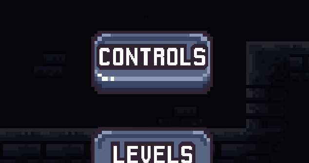
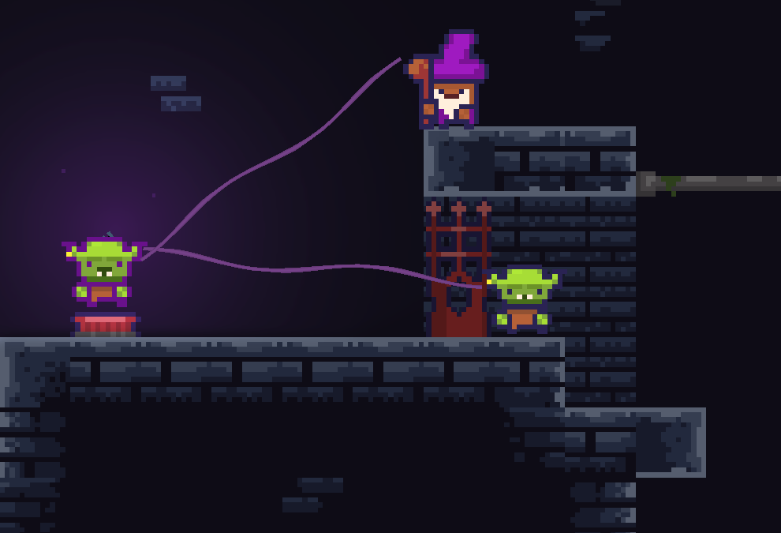
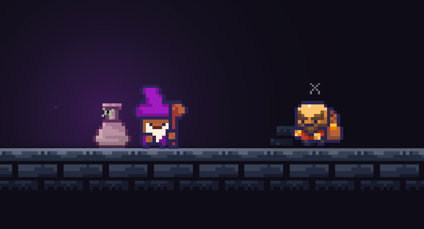
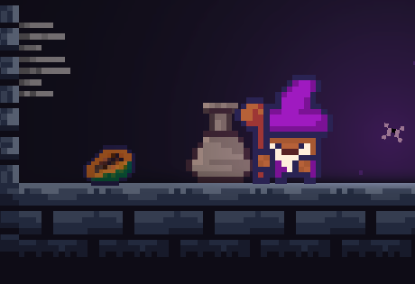

# Mind Weaver

You wake up as a mage, trapped deep within the confines of a dungeon ruled by goblins. Luckily, your butterfly companion has managed to set you free. It is now up to your imagination and your ability to control minds to help you escape!

## How to play

Download the latest version (jar file) from the [Releases](https://github.com/m4mbo/mind-weaver/releases) section or alternatively [build from source](#building-from-source). 
***Update:*** Now also available on [Steam](https://store.steampowered.com/app/3158220/Mind_Weaver/)!

### Controls

For more information on the controls, please refer to the 'Controls' section inside the game's main menu (ESC).

<div align="center">
  
</div>

## What to expect?

* **Lights** and **particle effects** 
* *Pixel perfect movement*
* 5 levels of **increasing** diffculty 
* Brain wrecking **puzzles** 
* **PAPAYA** 

Refer to [screenshots](#screenshots).

## Dependencies

**Java 17** or above is required to run the game.

## Building from source 

Unix based systems:

```
cd scripts
./run.sh
```

## Credits

* [m4mbo](https://github.com/m4mbo)  - Game idea, Art, Code
* [RedHatParichay](https://github.com/RedHatParichay) - UI related code

## Screenshots

<div align="center">
  
</div>

**Description:** Puzzles

<div align="center">
  
</div>

**Description:** Lights, shaders, animation and particle effects.


<div align="center">
  
</div>

**Description:** PAPAYA

